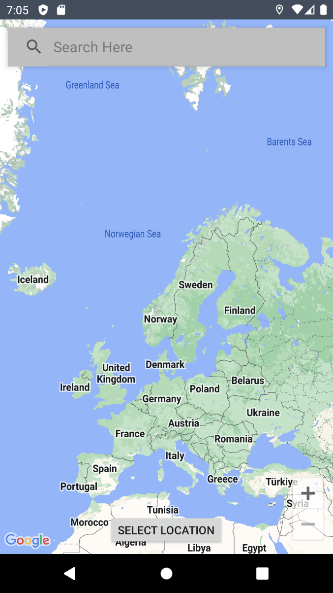
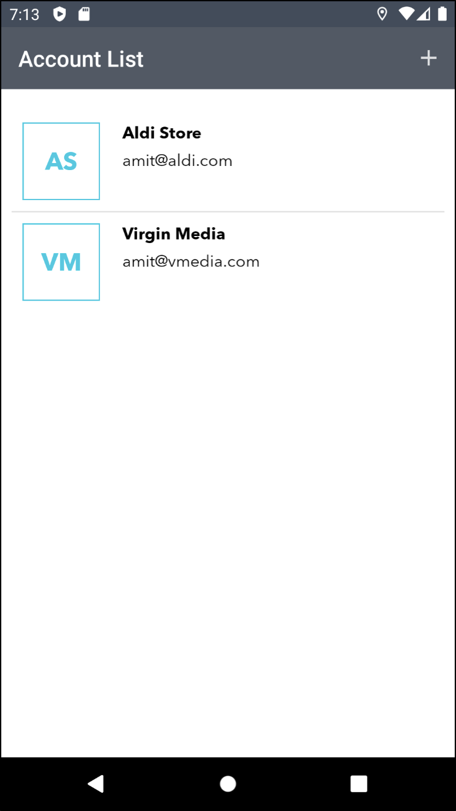

**Timeline:** 06 May 2024 - 13 Sep 2024   
**Role:** Android Mobile App Developer    
**Type of Project:** Android Mobile App for 2FA (Academic Project)   
**Location:** Huddersfield(UK)   
**Outcome:** Learn and about existing Authentication, Authorization technologies and proposed new methodology for 2FA

---

# 2FA-auth
Mobile Application for Two Factor Authentication(2FA) with geo location

## Project Overview  

The growing field of IoT-related authentication is rapidly being adopted across industries as internet security becomes increasingly important. Multi-Factor Authentication (MFA) improves security by requiring multiple methods of authentication — such as passwords and one-time passwords (OTPs).  

Two-Factor Authentication (2FA) adds an additional security layer by requiring two identifiers:  
1. **First factor:** Username and password  
2. **Second factor:** A mobile device to complete authentication  

However, users sometimes forget or lose access to their mobile device, making it impossible to authenticate even when they are authorized.  

This project proposes a **location-aware mobile 2FA application** that verifies the device’s location during authentication. If the device is at a trusted location (e.g., home, gym, clubhouse), the user can bypass OTP verification by answering predefined security questions, allowing access to the system without physical device presence.

---

## Features  

- **Android mobile application** for Two-Factor Authentication (2FA)  
- Secure token generation and storage against user accounts  
- **Trusted location management** — add, update, or delete geo-coordinates such as home or office  
- **Fallback authentication** using security questions if OTP is not available  
- **Server-side storage** for user account details, trusted locations, and security question data  
- **Location verification** using device GPS services  

---

## How It Works  

1. The user logs into a system with a username and password (first factor).  
2. The application checks the device’s current location.  
3. If the device is at a **trusted location**, the user is allowed to proceed without OTP.  
4. If not at a trusted location, the user must authenticate using TOTP and security questions.  
5. Users can add or update trusted locations via the mobile app.  

---

## Tech Stack  

- **Platform:** Android  
- **Languages:** Java  
- **Frameworks/Tools:** Android Studio, Gradle  
- **Services:** Mobile location services (GPS), Firebase Cloud Messaging - Google, REST API 
- **Server:** Application server to manage user accounts, trusted locations, and security questions  

---

## How to Import the Project
1. Clone the repository:
   ```bash
   git clone https://github.com/amitne7/2FA-auth;
   cd 2FA-auth;
   ```

2. Open **Android Studio**.  
   - Select **File > Open**  
   - Navigate to the cloned repository folder and select it.  

3. Let Android Studio **sync Gradle** and download all dependencies.  

  ## Running on Emulator

1. Open **Device Manager** in Android Studio:  
   - Click on **Tools > Device Manager**.  
   - Create a new Virtual Device (e.g., Pixel 6, Android 12).  
   - Download the required **System Image** (if not already installed).  

2. Select the emulator and **click Run** to launch it.  

3. Run the app:  
   - Click the green **Run button** in Android Studio.  
   - Choose the emulator device from the list.  
   - The app will be built, installed, and launched inside the emulator.  

---

## Running on a Real Device

1. Enable **Developer Options** on your phone(these steps can be vary on device to device):  
   - Go to **Settings > About phone**.  
   - Tap **Build number** 7 times until "Developer Mode" is enabled.  

2. Enable **USB Debugging**:  
   - Go to **Settings > Developer options**.  
   - Turn on **USB debugging**.  

3. Connect your phone to your computer via USB.  
   - You may need to install your device’s USB drivers.  

4. Verify that the device is detected:  

   ```bash
   adb devices
   ```

   You should see your device listed.

## Quick Start (CLI)

For advanced users who prefer command-line execution:  
```bash
# 1. Clone the repository:
   git clone https://github.com/amitne7/2FA-auth;
   cd 2FA-auth;

# 2. Build the project (assemble debug APK)
./gradlew assembleDebug

# 3. Install the APK on a connected device/emulator
adb install -r app/build/outputs/apk/debug/app-debug.apk

# 4. Run unit tests
./gradlew test

# 5. Run instrumentation tests on emulator/real device
./gradlew connectedAndroidTest
```

---

# Evidence
**Screenshots**
-  - Add account
-  - Select Location to add as trusted location
-  - List of added accounts
-  - Firebase push notification for access code
-  - Get access code form notification

**Workflow Diagram**
-  - App workflow for first factor and second factor using mobile application
-  - Add account workflow for mobile application

---

# Timeline
**Progress log week wise**
- [Download progress log](PROGRESSLOG.md)


